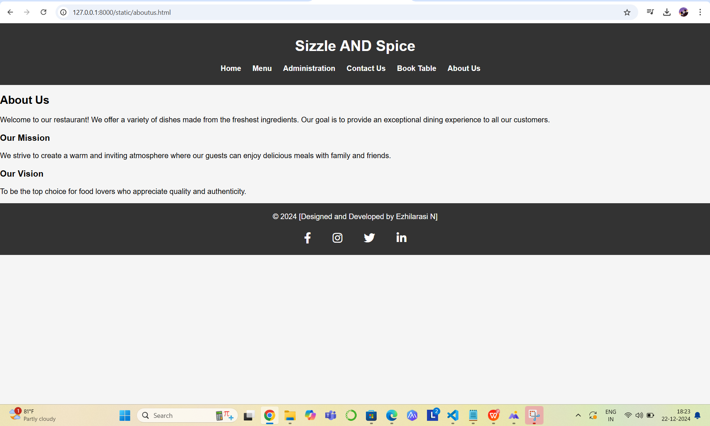

# Ex.07 Restaurant Website
## Date: 13.12.2024

## AIM:
To develop a static Restaurant website to display the food items and services provided by them.

## DESIGN STEPS:

### Step 1:
Requirement collection.

### Step 2:
Creating the layout using HTML and CSS.

### Step 3:
Updating the sample content.

### Step 4:
Choose the appropriate style and color scheme.

### Step 5:
Validate the layout in various browsers.

### Step 6:
Validate the HTML code.

### Step 7:
Publish the website in the given URL.

## PROGRAM:
```
index.html

<!DOCTYPE html>
<html lang="en">
<head>
    <meta charset="UTF-8">
    <meta name="viewport" content="width=device-width, initial-scale=1.0">
    <title>Website Home</title>
    <link rel="stylesheet" href="style.css">
    <link rel="stylesheet" href="https://cdnjs.cloudflare.com/ajax/libs/font-awesome/6.0.0-beta3/css/all.min.css">
</head>
<body>
    <header>
        <div class="logo">
            <h1>Sizzle AND Spice</h1>
        </div>
        <nav>
            <ul>
                <li><a href="index.html">Home</a></li>
                <li><a href="menu.html">Menu</a></li>
                <li><a href="administration.html">Administration</a></li>
                <li><a href="contact.html">Contact Us</a></li>
                <li><a href="booktable.html">Book Table</a></li>
                <li><a href="aboutus.html">About Us</a></li>
            </ul>
        </nav>
    </header>

    <div class="banner">
        
    </div>

    <section class="welcome">
        <h2>Welcome to Our Restaurant!</h2>
        <p>Enjoy the best dishes and a cozy atmosphere. Discover our delicious menu today!</p>
    </section>

    <section class="auth-section">
        <h2>Get Started</h2>
        <p>Join our community or log in to explore more!</p>
        <div class="auth-buttons">
            <a href="login.html" class="btn login-btn">Login</a>
            <a href="register.html" class="btn register-btn">Register</a>
        </div>
    </section>

    <footer>
        <div class="footer-content">
            <p>&copy; 2024 [Designed and Developed by Ezhilarasi N]</p>
            <div class="social-media">
                <a href="https://www.facebook.com" target="_blank" class="social-icon">
                    <i class="fab fa-facebook-f"></i>
                </a>
                <a href="https://www.instagram.com" target="_blank" class="social-icon">
                    <i class="fab fa-instagram"></i>
                </a>
                <a href="https://twitter.com" target="_blank" class="social-icon">
                    <i class="fab fa-twitter"></i>
                </a>
                <a href="https://www.linkedin.com" target="_blank" class="social-icon">
                    <i class="fab fa-linkedin-in"></i>
                </a>
            </div>
        </div>
    </footer>
</body>
</html>

login.html

<!DOCTYPE html>
<html lang="en">
<head>
    <meta charset="UTF-8">
    <meta name="viewport" content="width=device-width, initial-scale=1.0">
    <title>Login</title>
    <style>
        
        body {
            font-family: Arial, sans-serif;
            margin: 0;
            padding: 0;
            background-color: #f5f5f5;
            display: flex;
            justify-content: center;
            align-items: center;
            height: 100vh;
        }

        
        .auth-container {
            background-color: white;
            padding: 40px 30px;
            box-shadow: 0 4px 6px rgba(0, 0, 0, 0.1);
            border-radius: 8px;
            width: 100%;
            max-width: 400px;
            text-align: center;
        }

        
        h2 {
            font-size: 2em;
            color: #333;
            margin-bottom: 30px;
        }

        
        .form-group {
            margin-bottom: 20px;
            text-align: left;
        }

        .form-group label {
            font-size: 1.1em;
            color: #333;
            margin-bottom: 5px;
            display: block;
        }

        .form-group input {
            width: 100%;
            padding: 12px;
            font-size: 1em;
            border: 1px solid #ccc;
            border-radius: 4px;
            background-color: #f9f9f9;
            margin-top: 5px;
        }

        .form-group input:focus {
            border-color: #f39c12;
            outline: none;
        }

        /* Submit button */
        .submit-btn {
            width: 100%;
            padding: 15px;
            background-color: #f39c12;
            color: white;
            border: none;
            font-size: 1.2em;
            border-radius: 4px;
            cursor: pointer;
            transition: background-color 0.3s ease;
        }

        .submit-btn:hover {
            background-color: #e67e22;
        }

        /* Link and alternative action */
        .auth-switch {
            font-size: 1em;
            color: #666;
        }

        .auth-switch a {
            color: #f39c12;
            text-decoration: none;
        }

        .auth-switch a:hover {
            text-decoration: underline;
        }

    </style>
</head>

<body>
    <div class="auth-container">
        <h2>Login</h2>
        <form action="process-login.php" method="POST" class="auth-form">
            <div class="form-group">
                <label for="email">Email</label>
                <input type="email" id="email" name="email" placeholder="Enter your email" required>
            </div>
            <div class="form-group">
                <label for="password">Password</label>
                <input type="password" id="password" name="password" placeholder="Enter your password" required>
            </div>
            <button type="submit" class="submit-btn">Login</button>
            <p class="auth-switch">
                Don't have an account? <a href="register.html">Register here</a>.
            </p>
        </form>
    </div>
</body>
</html>

register.html

<!DOCTYPE html>
<html lang="en">
<head>
    <meta charset="UTF-8">
    <meta name="viewport" content="width=device-width, initial-scale=1.0">
    <title>Register</title>
   
    <style>
        
        body {
            font-family: Arial, sans-serif;
            margin: 0;
            padding: 0;
            background-color: #f5f5f5;
            display: flex;
            justify-content: center;
            align-items: center;
            height: 100vh;
        }

        
        .auth-container {
            background-color: white;
            padding: 40px 30px;
            box-shadow: 0 4px 6px rgba(0, 0, 0, 0.1);
            border-radius: 8px;
            width: 100%;
            max-width: 400px;
            text-align: center;
        }

        
        h2 {
            font-size: 2em;
            color: #333;
            margin-bottom: 30px;
        }

        
        .form-group {
            margin-bottom: 20px;
            text-align: left;
        }

        .form-group label {
            font-size: 1.1em;
            color: #333;
            margin-bottom: 5px;
            display: block;
        }

        .form-group input {
            width: 100%;
            padding: 12px;
            font-size: 1em;
            border: 1px solid #ccc;
            border-radius: 4px;
            background-color: #f9f9f9;
            margin-top: 5px;
        }

        .form-group input:focus {
            border-color: #f39c12;
            outline: none;
        }

        
        .submit-btn {
            width: 100%;
            padding: 15px;
            background-color: #f39c12;
            color: white;
            border: none;
            font-size: 1.2em;
            border-radius: 4px;
            cursor: pointer;
            transition: background-color 0.3s ease;
        }

        .submit-btn:hover {
            background-color: #e67e22;
        }

        
        .auth-switch {
            font-size: 1em;
            color: #666;
        }

        .auth-switch a {
            color: #f39c12;
            text-decoration: none;
        }

        .auth-switch a:hover {
            text-decoration: underline;
        }

    </style>
</head>
<body>
    <div class="auth-container">
        <h2>Register</h2>
        <form action="process-register.php" method="POST" class="auth-form">
            <div class="form-group">
                <label for="name">Full Name</label>
                <input type="text" id="name" name="name" placeholder="Enter your full name" required>
            </div>
            <div class="form-group">
                <label for="email">Email</label>
                <input type="email" id="email" name="email" placeholder="Enter your email" required>
            </div>
            <div class="form-group">
                <label for="password">Password</label>
                <input type="password" id="password" name="password" placeholder="Create a password" required>
            </div>
            <div class="form-group">
                <label for="confirm-password">Confirm Password</label>
                <input type="password" id="confirm-password" name="confirm_password" placeholder="Confirm your password" required>
            </div>
            <button type="submit" class="submit-btn">Register</button>
            <p class="auth-switch">
                Already have an account? <a href="login.html">Login here</a>.
            </p>
        </form>
    </div>
</body>
</html>


menu.html

<!DOCTYPE html>
<html lang="en">
<head>
    <meta charset="UTF-8">
    <meta name="viewport" content="width=device-width, initial-scale=1.0">
    <title>Menu</title>
    <link rel="stylesheet" href="style.css">
    <link rel="stylesheet" href="https://cdnjs.cloudflare.com/ajax/libs/font-awesome/6.0.0-beta3/css/all.min.css">
</head>
<body>
    <header>
        <div class="logo">
            <h1>Sizzle AND Spice</h1>
        </div>
        <nav>
            <ul>
                <li><a href="index.html">Home</a></li>
                <li><a href="menu.html">Menu</a></li>
                <li><a href="administration.html">Administration</a></li>
                <li><a href="contact.html">Contact Us</a></li>
                <li><a href="booktable.html">Book Table</a></li>
                <li><a href="aboutus.html">About Us</a></li>
            </ul>
        </nav>
    </header>

    <section class="menu">
        <h2>Our Menu</h2>
        <h3>Appetizers</h3>
        <ul>
            <li>Chicken Wings</li>
            <li>Crispy Calamari Rings</li>
            <li>Mutton Seekh Kebab</li>
            <li>Spicy Chicken Nachos</li>
            <li>Fish Tikka</li>
        </ul>
        <h3>Appetizers</h3>
        <ul>
            <li>Chicken Wings</li>
            <li>Crispy Calamari Rings</li>
            <li>Mutton Seekh Kebab</li>
            <li>Spicy Chicken Nachos</li>
            <li>Fish Tikka</li>
        </ul>
        <h2>Main Course</h2>
        <h3>Chicken Dishes</h3>
        <ul>
            <li>Butter Chicken</li>
            <li>Chicken Tikka Masala</li>
            <li>Grilled Lemon Herb Chicken</li>
            <li>Spicy Chicken Curry</li>
            <li>Chicken Alfredo Pasta</li>
        </ul>
        <h3>Mutton Dishes</h3>
        <ul>
            <li>Rogan Josh</li>
            <li>Mutton Biryani</li>
            <li>Lamb Chops with Garlic Sauce</li>
            <li>Mutton Korma</li>
        </ul>
        <h3>Seafood</h3>
        <ul>
            <li>Grilled Salmon with Lemon Butter</li>
            <li>Prawns in Garlic Sauce</li>
            <li>Crab Curry</li>
            <li>Fish and Chips</li>
        </ul>
        <h3>Rice & Noodles</h3>
        <ul>
            <li>Chicken Fried Rice</li>
            <li>Egg Biryani</li>
            <li>Prawn Noodles</li>
            <li>Thai Seafood Rice</li>
        </ul>
        <h3>Sides</h3>
        <ul>
            <li>Garlic Butter Prawns</li>
            <li>Spicy Lamb Meatballs</li>
            <li>Tandoori Chicken Wings</li>
        </ul>
        <h3>Desserts</h3>
        <ul>
            <li>Chocolate Lava Cake with Ice Cream</li>
            <li>Caramel Custard</li>
            <li>Mango Mousse</li>
            <li>Gulab Jamun</li>
        </ul>
        <h1>Special Offers</h1>
        <ul>
            <li>2-for-1 on Beef Burgers</li>
            <li>Free Drink with Every Main Course</li>
            <li>20% Off on Desserts</li>
        </ul>
    </section>

    <footer>
        <div class="footer-content">
            <p>&copy; 2024 [Designed and Developed by Ezhilarasi N]</p>
            <div class="social-media">
                <a href="https://www.facebook.com" target="_blank" class="social-icon">
                    <i class="fab fa-facebook-f"></i>
                </a>
                <a href="https://www.instagram.com" target="_blank" class="social-icon">
                    <i class="fab fa-instagram"></i>
                </a>
                <a href="https://twitter.com" target="_blank" class="social-icon">
                    <i class="fab fa-twitter"></i>
                </a>
                <a href="https://www.linkedin.com" target="_blank" class="social-icon">
                    <i class="fab fa-linkedin-in"></i>
                </a>
            </div>
        </div>
    </footer>
</body>
</html>


administration.html

<!DOCTYPE html>
<html lang="en">
<head>
    <meta charset="UTF-8">
    <meta name="viewport" content="width=device-width, initial-scale=1.0">
    <title>Administration</title>
    <link rel="stylesheet" href="style.css">
    <link rel="stylesheet" href="https://cdnjs.cloudflare.com/ajax/libs/font-awesome/6.0.0-beta3/css/all.min.css">
</head>
<body>
    <header>
        <div class="logo">
            <h1>Sizzle AND Spice</h1>
        </div>
        <nav>
            <ul>
                <li><a href="index.html">Home</a></li>
                <li><a href="menu.html">Menu</a></li>
                <li><a href="administration.html">Administration</a></li>
                <li><a href="contact.html">Contact Us</a></li>
                <li><a href="booktable.html">Book Table</a></li>
                <li><a href="aboutus.html">About Us</a></li>
            </ul>
        </nav>
    </header>

    <section class="administration">
        <h2>Our Team</h2>
        <div class="team">
            <div class="member">
                
                <h3>Dhanush</h3>
                <p>CEO</p>
            </div>
            <div class="member">
                
                <h3>Rashmika</h3>
                <p>Manager</p>
            </div>
            <div class="member">
                
                <h3>Joseph Vijay</h3>
                <p>Head Chef</p>
            </div>
            <div class="member">
                
                <h3>Samantha</h3>
                <p>Marketing Lead</p>
            </div>
            <div class="member">
                
                <h3>Tamannaah</h3>
                <p>HR Manager</p>
            </div>
            <div class="member">
                
                <h3>Ajith</h3>
                <p>Customer Relations</p>
            </div>
        </div>
    </section>

    <footer>
        <div class="footer-content">
            <p>&copy; 2024 [Designed and Developed by Ezhilarasi N]</p>
            <div class="social-media">
                <a href="https://www.facebook.com" target="_blank" class="social-icon">
                    <i class="fab fa-facebook-f"></i>
                </a>
                <a href="https://www.instagram.com" target="_blank" class="social-icon">
                    <i class="fab fa-instagram"></i>
                </a>
                <a href="https://twitter.com" target="_blank" class="social-icon">
                    <i class="fab fa-twitter"></i>
                </a>
                <a href="https://www.linkedin.com" target="_blank" class="social-icon">
                    <i class="fab fa-linkedin-in"></i>
                </a>
            </div>
        </div>
    </footer>
</body>
</html>


contact.html

<!DOCTYPE html>
<html lang="en">
<head>
    <meta charset="UTF-8">
    <meta name="viewport" content="width=device-width, initial-scale=1.0">
    <title>Contact Us</title>
    <link rel="stylesheet" href="style.css">
    <link rel="stylesheet" href="https://cdnjs.cloudflare.com/ajax/libs/font-awesome/6.0.0-beta3/css/all.min.css">
</head>
<body>
    <header>
        <div class="logo">
            <h1>Sizzle AND Spice</h1>
        </div>
        <nav>
            <ul>
                <li><a href="index.html">Home</a></li>
                <li><a href="menu.html">Menu</a></li>
                <li><a href="administration.html">Administration</a></li>
                <li><a href="contact.html">Contact Us</a></li>
                <li><a href="booktable.html">Book Table</a></li>
                <li><a href="aboutus.html">About Us</a></li>
            </ul>
        </nav>
    </header>

    <section class="contact">
        <h2>Contact Us</h2>
        <p>Address: 123 Main Street, City, Country</p>
        <p>Phone: +123 456 7890</p>
        <p>Email: contact@restaurant.com</p>
        
        <h3>Opening Hours:</h3>
        <ul>
            <li>Monday to Friday: 9:00 AM - 10:00 PM</li>
            <li>Saturday: 10:00 AM - 11:00 PM</li>
            <li>Sunday: Closed</li>
        </ul>
    </section>
    

    <footer>
        <div class="footer-content">
            <p>&copy; 2024 [Designed and Developed by Ezhilarasi N]</p>
            <div class="social-media">
                <a href="https://www.facebook.com" target="_blank" class="social-icon">
                    <i class="fab fa-facebook-f"></i>
                </a>
                <a href="https://www.instagram.com" target="_blank" class="social-icon">
                    <i class="fab fa-instagram"></i>
                </a>
                <a href="https://twitter.com" target="_blank" class="social-icon">
                    <i class="fab fa-twitter"></i>
                </a>
                <a href="https://www.linkedin.com" target="_blank" class="social-icon">
                    <i class="fab fa-linkedin-in"></i>
                </a>
            </div>
        </div>
    </footer>
</body>
</html>


booktable.html

<!DOCTYPE html>
<html lang="en">
<head>
    <meta charset="UTF-8">
    <meta name="viewport" content="width=device-width, initial-scale=1.0">
    <title>Book a Table</title>
    <link rel="stylesheet" href="style.css">
    <link rel="stylesheet" href="https://cdnjs.cloudflare.com/ajax/libs/font-awesome/6.0.0-beta3/css/all.min.css">
</head>
<body>
    <header>
        <div class="logo">
            <h1>Sizzle AND Spice</h1>
        </div>
        <nav>
            <ul>
                <li><a href="index.html">Home</a></li>
                <li><a href="menu.html">Menu</a></li>
                <li><a href="administration.html">Administration</a></li>
                <li><a href="contact.html">Contact Us</a></li>
                <li><a href="booktable.html">Book Table</a></li>
                <li><a href="aboutus.html">About Us</a></li>
            </ul>
        </nav>
    </header>

    <section class="book-table">
        <h2>Book a Table</h2>
        <form action="#" method="post">
            <label for="name">Your Name:</label>
            <input type="text" id="name" name="name" required>

            <label for="phone">Phone Number:</label>
            <input type="tel" id="phone" name="phone" required>

            <label for="date">Reservation Date:</label>
            <input type="date" id="date" name="date" required>

            <label for="time">Reservation Time:</label>
            <input type="time" id="time" name="time" required>

            <label for="people">Number of People:</label>
            <input type="number" id="people" name="people" required>

            <button type="submit">Book Now</button>
        </form>
    </section>

    <footer>
        <div class="footer-content">
            <p>&copy; 2024 [Designed and Developed by Ezhilarasi N]</p>
            <div class="social-media">
                <a href="https://www.facebook.com" target="_blank" class="social-icon">
                    <i class="fab fa-facebook-f"></i>
                </a>
                <a href="https://www.instagram.com" target="_blank" class="social-icon">
                    <i class="fab fa-instagram"></i>
                </a>
                <a href="https://twitter.com" target="_blank" class="social-icon">
                    <i class="fab fa-twitter"></i>
                </a>
                <a href="https://www.linkedin.com" target="_blank" class="social-icon">
                    <i class="fab fa-linkedin-in"></i>
                </a>
            </div>
        </div>
    </footer>
</body>
</html>

aboutus.html

<!DOCTYPE html>
<html lang="en">
<head>
    <meta charset="UTF-8">
    <meta name="viewport" content="width=device-width, initial-scale=1.0">
    <title>About Us</title>
    <link rel="stylesheet" href="style.css">
    <link rel="stylesheet" href="https://cdnjs.cloudflare.com/ajax/libs/font-awesome/6.0.0-beta3/css/all.min.css">
</head>
<body>
    <header>
        <div class="logo">
            <h1>Sizzle AND Spice</h1>
        </div>
        <nav>
            <ul>
                <li><a href="index.html">Home</a></li>
                <li><a href="menu.html">Menu</a></li>
                <li><a href="administration.html">Administration</a></li>
                <li><a href="contact.html">Contact Us</a></li>
                <li><a href="booktable.html">Book Table</a></li>
                <li><a href="aboutus.html">About Us</a></li>
            </ul>
        </nav>
    </header>

    <section class="aboutus">
        <h2>About Us</h2>
        <p>Welcome to our restaurant! We offer a variety of dishes made from the freshest ingredients. Our goal is to provide an exceptional dining experience to all our customers.</p>
        <h3>Our Mission</h3>
        <p>We strive to create a warm and inviting atmosphere where our guests can enjoy delicious meals with family and friends.</p>
        <h3>Our Vision</h3>
        <p>To be the top choice for food lovers who appreciate quality and authenticity.</p>
    </section>

    <footer>
        <div class="footer-content">
            <p>&copy; 2024 [Designed and Developed by Ezhilarasi N]</p>
            <div class="social-media">
                <a href="https://www.facebook.com" target="_blank" class="social-icon">
                    <i class="fab fa-facebook-f"></i>
                </a>
                <a href="https://www.instagram.com" target="_blank" class="social-icon">
                    <i class="fab fa-instagram"></i>
                </a>
                <a href="https://twitter.com" target="_blank" class="social-icon">
                    <i class="fab fa-twitter"></i>
                </a>
                <a href="https://www.linkedin.com" target="_blank" class="social-icon">
                    <i class="fab fa-linkedin-in"></i>
                </a>
            </div>
        </div>
    </footer>
</body>
</html>


style.css

body {
    font-family: Arial, sans-serif;
    margin: 0;
    padding: 0;
    background-color: #f5f5f5;
}

header {
    background-color: #333;
    color: white;
    padding: 10px 0;
    text-align: center;
}

header nav ul {
    list-style-type: none;
    padding: 0;
}

header nav ul li {
    display: inline;
    margin-right: 20px;
}

header nav ul li a {
    color: white;
    text-decoration: none;
    font-weight: bold;
}

footer {
    text-align: center;
    padding: 10px 0;
    background-color: #333;
    color: white;
}

.banner img {
    width: 100%;
    height: auto;
}

.welcome, .menu, .administration, .contact {
    padding: 20px;
    text-align: center;
}
.book-table form {
    width: 300px;
    margin: 0 auto;
    display: flex;
    flex-direction: column;
}

.book-table input, .book-table button {
    margin-bottom: 15px;
    padding: 10px;
    font-size: 16px;
}

.book-table button {
    background-color: #333;
    color: white;
    border: none;
    cursor: pointer;
}

.book-table button:hover {
    background-color: #f39c12;
}

/* Menu Section */
.menu ul {
    list-style-type: none;
    padding: 0;
}

.menu h3 {
    font-size: 1.5em;
    color: #f39c12;
}


.menu ul li {
    padding: 5px 0;
}

.administration .team {
    display: grid;
    grid-template-columns: repeat(3, 1fr);
    gap: 20px;
}

.administration .member {
    text-align: center;
}

.administration .member img {
    width: 150px;
    height: 150px;
    border-radius: 50%;
    object-fit: cover;
}

.auth-section {
    text-align: center;
    padding: 50px 20px;
    background-color: #f5f5f5;
}

.auth-section h2 {
    font-size: 2.2em;
    color: #333;
    margin-bottom: 15px;
}

.auth-section p {
    font-size: 1.1em;
    color: #666;
    margin-bottom: 30px;
}

.auth-buttons .btn {
    padding: 15px 25px;
    background-color: #f39c12;
    color: white;
    text-decoration: none;
    border-radius: 5px;
    font-size: 1.2em;
    transition: background-color 0.3s ease;
    margin: 0 15px;
}

.auth-buttons .btn:hover {
    background-color: #e67e22;
}

footer {
    background-color: #333;
    color: white;
    text-align: center;
    padding: 20px 0;
    position: relative;
    bottom: 0;
    width: 100%;
}

.footer-content {
    display: flex;
    flex-direction: column;
    align-items: center;
}

.footer-content p {
    margin: 0;
    padding-bottom: 10px;
}

.social-media {
    margin-top: 10px;
}

.social-icon {
    color: white;
    font-size: 24px;
    margin: 0 15px;
    text-decoration: none;
    transition: color 0.3s ease;
}

.social-icon:hover {
    color: #f39c12; /* Change color on hover (gold color for effect) */
}

.social-icon:active {
    color: #e67e22; /* Active state color */
}

.social-icon i {
    padding: 5px;
}


header {
    background-color: #333;
    color: white;
    padding: 10px 0;
    text-align: center;
}

header nav ul {
    list-style-type: none;
    padding: 0;
}

header nav ul li {
    display: inline;
    margin-right: 20px;
}

header nav ul li a {
    color: white;
    text-decoration: none;
    font-weight: bold;
}

.booktable form {
    width: 300px;
    margin: 0 auto;
    display: flex;
    flex-direction: column;
}

.booktable input, .book-table button {
    margin-bottom: 15px;
    padding: 10px;
    font-size: 16px;
}

.booktable button {
    background-color: #333;
    color: white;
    border: none;
    cursor: pointer;
}

.booktable button:hover {
    background-color: #f39c12;
}


.menu ul {
    list-style-type: none;
    padding: 0;
}

.menu h3 {
    font-size: 1.5em;
    color: #f39c12;
}

```

## OUTPUT:




## RESULT:
The program for designing software company website using HTML and CSS is completed successfully.
